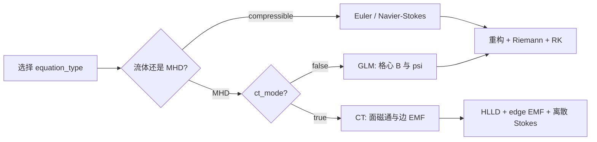
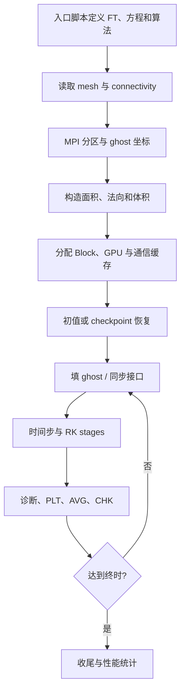
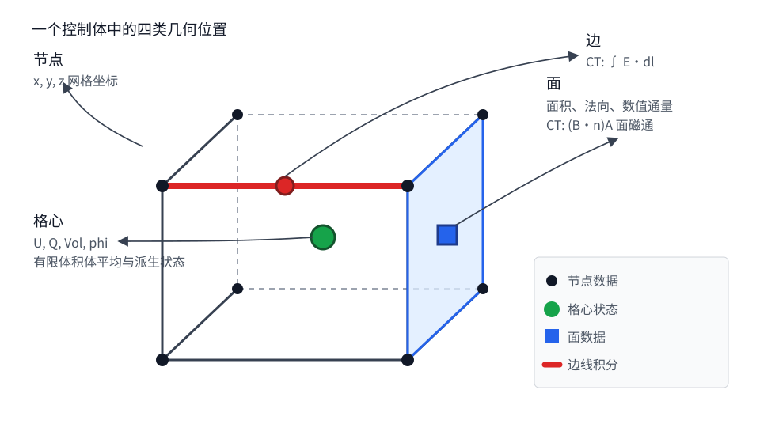
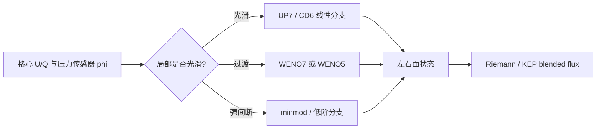
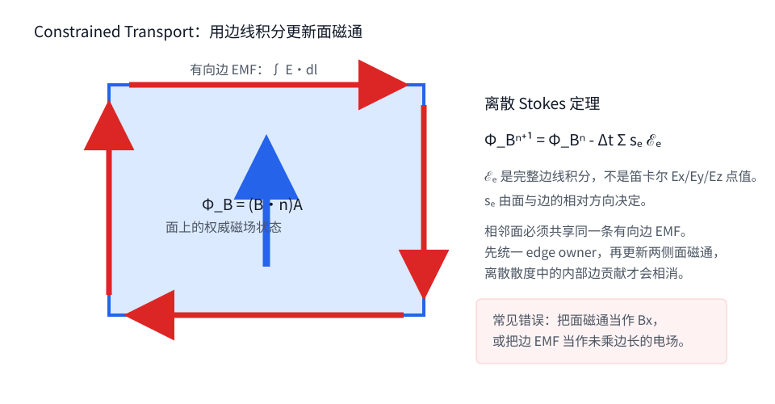
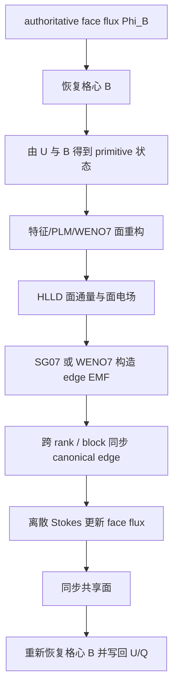

# OpenCFD-FVM-CUDA 理论、算法与使用手册

OpenCFD-FVM-CUDA 是一个面向结构化多块网格的可压缩流有限体积求解器，支持
CPU、CUDA、ROCm 和 MPI。它可以求解可压缩 Euler/Navier-Stokes 方程，也可以求解
MHD；MHD 又分为格心 GLM 清理和交错网格 Constrained Transport（CT）两条路径。

这本手册按“先建立图像，再阅读公式，最后进入实现”的顺序编写。正文用于学习和
使用求解器；完整的数组尺寸、配置表、文件格式和验证记录放在
[开发者参考](reference/implementation_contracts.md) 中。需要修改内核或核对精度结论时，
再查阅该附件。

## 1. 先认识这个求解器

### 1.1 它解决什么问题

程序提供三条主要方程路径：



- **可压缩 Euler**：质量、三个方向动量和总能量，共五个守恒量。
- **可压缩 Navier-Stokes**：在 Euler 方程上增加粘性应力和热传导。
- **MHD/GLM**：磁场和清理变量 `psi` 都存放在格心，通过守恒通量推进。
- **MHD/CT**：流体量仍在格心推进，磁场的权威状态改为面磁通，利用边上的
  电动势保持离散 `div B`。

这三条路径共享网格、有限体积更新、GPU/MPI 基础设施和大部分时间推进代码，但磁场
存储和更新方法不同。不要把 CT 的 `face-B`、edge EMF 或 HLLD 约束套用到纯可压缩
路径，也不要把 GLM 的 `psi` 方程理解成 CT 的一部分。

### 1.2 一次计算怎样进行

从入口脚本到结果文件，程序经历以下阶段：



理解程序时，最好始终追踪三个问题：

1. 当前数据位于节点、格心、面还是边？
2. 它是平均值、点值、面积分还是线积分？
3. 它是长期状态，还是只在一个 stage 内有效的工作缓存？

多数高阶精度错误、CT 符号错误和跨块棋盘格，都可以追溯到这三个问题之一。

### 1.3 推荐阅读路线

- 第一次阅读：第 2、3、4、6、7 章。
- 准备运行算例：第 8、9 章。
- 排查负压、能量发散或 `div B`：第 10 章。
- 研究高阶精度：第 4、6、11 章。
- 修改代码：正文读完后查阅
  [开发者参考](reference/implementation_contracts.md)。

## 2. 网格、控制体与数据位置

### 2.1 节点、格心、面和边

有限体积法围绕控制体进行守恒更新。网格文件给出节点坐标，节点围成控制体；流体
状态放在控制体中心，通量穿过控制体的面。在 CT 中，还需要在面的边界线上保存
电动势线积分。



图中的四类位置对应四类数组：

| 位置 | 主要数据 | 直观含义 |
|---|---|---|
| 节点 | `x/y/z` | 网格几何的原始输入 |
| 格心 | `U/Q/Vol/phi` | 控制体状态、逆体积和激波传感器 |
| 面 | 面积、法向、数值通量；CT 面磁通 | 一个控制体与邻居交换多少守恒量 |
| 边 | CT edge EMF | 围绕一个面的有向电动势线积分 |

设本 rank 在某个 block 上拥有的真实单元数为 `(N_i,N_j,N_k)`，ghost 层数为 `NG`，
则格心数组长度为

```math
C_d=N_d+2NG,
```

节点在每个方向比格心多一个位置。真实格心范围是 `NG+1:N_d+NG`；两侧其余位置
属于 ghost。`ox/oy/oz` 记录本 rank 的真实单元在全 block 中从哪里开始。

### 2.2 平均值、点值和积分量

对于控制体 `Omega_ijk`，体平均和格心点值分别为

```math
\bar a_{ijk}=\frac{1}{V_{ijk}}\int_{\Omega_{ijk}}a\,\mathrm dV,
\qquad
a^c_{ijk}=a(\boldsymbol{x}^c_{ijk}).
```

二者在二阶方法中常被近似混用，但在高阶有限体积法中必须区分。程序中的关键约定是：

- `U` 是有限体积更新使用的守恒状态，按体平均理解，不是已经乘过体积的积分量。
- `Q` 是由 `U` 转换得到的 primitive 缓存。一般可压缩路径直接做代数转换，因此
  `Q` 不自动成为高阶准确的格心点值。
- `Vol` 这个名字容易误导；它实际保存 `1/V_cell`。更新核用它把面通量差换成
  单位体积的变化率。
- CT 的 `Bx_face/By_face/Bz_face` 是 `(B·n)A` 的面磁通，而不是笛卡尔分量 `Bx/By/Bz`。
- CT 的 `Ex_edge/Ey_edge/Ez_edge` 是 `int E·dl`，已经包含边长。

这也是为什么“把格心 `B` 提高到六阶”不能单独证明整个 CT 算法达到六阶：面磁通、
edge EMF、几何、时间推进和边界闭合必须同时达到相应精度。

### 2.3 `U` 和 `Q` 中存什么

可压缩路径使用

```text
U = [rho, rho*u, rho*v, rho*w, rho*E]
Q = [rho, u,     v,     w,     p,     T]
```

MHD 路径使用

```text
U = [rho, rho*u, rho*v, rho*w, rho*E, Bx, By, Bz, psi]
Q = [rho, u,     v,     w,     p,     T,  Bx, By, Bz, psi]
```

GLM 会推进格心的 `B` 和 `psi`。CT 则只用有限体积通量推进 `U[1:5]`；`U[6:8]`
由交错面磁通恢复，作为格心 `B` 缓存，不能再当作独立守恒量推进。

### 2.4 block、ghost 与接口所有权

一个 block 是一片逻辑上连续的结构网格。MPI 可以把一个 block 再分成多个 rank
子域，也可以让一个 rank 持有多个局部 block。每个局部 block 拥有自己的长期状态，
但面通量等大工作数组按 rank 上最大的局部 block 分配并重复使用。

ghost 有三种来源：

1. 同一 block 内相邻 rank 的 halo 交换；
2. 不同 block 之间按 connectivity 做方向映射；
3. 物理边界条件生成的延拓值。

常规可压缩 halo 发送 `U[1:5]`，接收后再用 `c2Prim_ghost` 重建 ghost `Q`。缓冲区
虽然按 `Nprim=6` 容量分配，但实际消息槽数是 `Ncons=5`。MHD/CT 还需要同步面磁通
和共享 edge 的有向 EMF，不能只交换格心 `Q`。

完整数组维度和所有权表见
[开发者参考](reference/implementation_contracts.md#数据位置与所有权契约)。

## 3. 控制方程与热力学

### 3.1 可压缩 Euler/Navier-Stokes 方程

守恒形式写为

```math
\frac{\partial \boldsymbol U}{\partial t}
+\nabla\cdot\boldsymbol F_c
=\nabla\cdot\boldsymbol F_v+\boldsymbol S.
```

其中

```math
\boldsymbol U=
\begin{bmatrix}
\rho & \rho u & \rho v & \rho w & \rho E
\end{bmatrix}^{T},
\qquad
\rho E=\frac{p}{\gamma-1}
+\frac{1}{2}\rho(u^2+v^2+w^2).
```

理想气体关系为

```math
p=\rho R_gT.
```

当 `viscous=false` 时，只求解 Euler 方程；`viscous=true` 时加入应力张量和热通量。
程序没有一个全局单位系统，`R_g`、参考温度、初值、边界和源项必须在同一算例中
保持一致。

### 3.2 理想 MHD 方程

在 `mu_0=1` 的程序约定下，总能量为

```math
E=\frac{p}{\gamma-1}
+\frac{1}{2}\rho|\boldsymbol u|^2
+\frac{1}{2}|\boldsymbol B|^2.
```

理想 MHD 在 Euler 方程上增加洛伦兹力、磁压力和感应方程：

```math
\frac{\partial \boldsymbol B}{\partial t}
+\nabla\cdot(\boldsymbol u\boldsymbol B-\boldsymbol B\boldsymbol u)=0,
\qquad
\nabla\cdot\boldsymbol B=0.
```

总能量中的磁能不能在 primitive/conservative 转换时遗漏。很多“压力突然变负”的
现象，本质上是总能量减去动能和磁能后，剩余内能变成了负数。

### 3.3 GLM：用清理波携带散度误差

当 `equation_type=:MHD` 且 `ct_mode=false` 时，程序使用格心 GLM。Riemann 通量中的
磁场法向通量增加 `psi n`，清理变量的通量为

```math
F_\psi=c_h^2 B_n.
```

显式自适应步长路径会计算全局最大 `|u|+c_f` 作为 `ch_glm_current`。通量更新后，
`psi` 通过 operator-split 阻尼衰减：

```math
\psi^{n+1}=\psi^n\exp\!\left(-\Delta t\,\frac{c_h}{c_r}\right),
\qquad c_r=\texttt{cr\_glm}.
```

默认 `cr_glm=0.18`。当 `adaptive_dt=false` 时，自动更新 `c_h` 的分支不会执行，
不能假设它仍会跟随当前最大快磁声速度。

### 3.4 CT：让离散散度在拓扑上相消

CT 不通过额外清理波消除散度误差，而是改变磁场的存储位置：把法向磁场作为面磁通
保存，再由围绕面的 edge EMF 做离散 Stokes 更新。只要共享面和共享边的方向、所有权
和同步都一致，相邻控制体中的内部面贡献会成对相消。

这是一条几何和拓扑约束，不是简单地在更新后把 `div B` 减掉。第 6 章详细说明
面磁通、edge EMF、HLLD 和高阶重构怎样组合。

电阻 MHD 在 CT 路径中把 Ohm 定律的扩散项写入边电场，

```math
\boldsymbol E=-\boldsymbol u\times\boldsymbol B+\eta_{mhd}\boldsymbol J,
\qquad \boldsymbol J=\nabla\times\boldsymbol B,
```

再用同一套离散 Stokes 算子推进权威面磁通。对应的总能量通量与面磁通更新使用同一
电阻电场，因此磁能耗散、焦耳热和总能量保持闭合。`ct_resistive_integrator=:explicit`
把电阻项放在主 SSP-RK3 的每个 stage 内，光滑问题可保持三阶时间精度，但受显式扩散
时间步限制。`:sts` 使用一阶阻尼 Chebyshev super-time-stepping，并在主 RK3 后做一次
Lie 分裂，整体为一阶。`:rkl2_strang` 则按“RKL2 电阻半步、理想 SSP-RK3 全步、RKL2
电阻半步”推进；RKL2 与显式路径复用同一套高阶电阻面通量，只关闭分裂半步中的流体
黏性与热传导。每个 RKL2 stage 都同步 face-B、总能量、格心状态、ghost 和接口，光滑
自治问题整体为二阶。

## 4. 从格心状态到面通量

### 4.1 有限体积更新的核心

对一个控制体积分后，守恒量的变化来自六个面的净通量：

```math
\frac{\mathrm d\bar{\boldsymbol U}_{ijk}}{\mathrm dt}
=-\frac{1}{V_{ijk}}
\sum_{f\in\partial\Omega_{ijk}}
\widehat{\boldsymbol F}_f A_f
+\bar{\boldsymbol S}_{ijk}.
```

因此空间离散可以分成三个问题：

1. 从两侧格心状态重构出面的左右状态；
2. 在面法向的一维局部坐标中求数值通量；
3. 乘面面积并按方向累加到相邻控制体。

### 4.2 重构不是普通插值

重构的输入是控制体平均量，输出是界面左右侧的极限值。二阶时平均值和格心点值的
差异常被截断误差掩盖；高阶时，直接套用点值插值公式会丢失目标阶数。OpenCFD-EC
理论手册特别强调了这一点，本程序的 POINT6 与 average-to-point 工作也是在解决同一
问题。

当前可压缩路径按激波传感器选择局部格式：



`phi` 在每个 step 进入 RK 前预计算，显式 RK stage 1 再刷新并交换，stage 2、3 复用。
阈值由入口脚本给出；程序没有通用 parser 保证阈值顺序正确。

### 4.3 分量重构与特征重构

分量重构分别处理每个守恒量或 primitive 分量，成本较低，但激波附近不同波族容易
互相污染。特征重构先用局部 Jacobian 的左右特征向量把状态投影到各个波族，分别做
WENO，再投影回来。

可压缩路径的实际开关是 `eigen_reconstruction`。历史变量 `character` 仍可在部分
配置片段中看到，但生产 dispatch 不消费它。

MHD 特征系比 Euler 更复杂，包含快/慢磁声波、Alfven 波、接触波和退化状态。程序在
局部正交基中构造 eigensystem，并对退化范数、密度和压力做检查。第 6 章说明它如何
与 HLLD 配合。

### 4.4 Riemann 通量与 KEP 混合

左右状态进入面法向的一维 Riemann 问题。可压缩路径提供 HLLC、Steger-Warming、
Van Leer、Roe 和 KEP/blended 分支；具体 ID 与入口默认值见附录 A。

光滑区可在低耗散 KEP 通量和上风通量之间混合：

```math
F=(1-\texttt{local\_lin\_phi})F_{KEP}
+\texttt{local\_lin\_phi}F_{upwind}.
```

KEP 的目标是改善离散动能行为，不等同于 positivity-preserving。Riemann 内部的压力
floor、Rusanov fallback 或零通量修复只能视为防御路径；它们可能避免立即崩溃，也可能
掩盖更早出现的重构、几何或能量错误。

### 4.5 空间阶数由整条链的最低阶环节决定

在光滑均匀网格上，WENO7/UP7 可以给出高阶面值，四点 Gauss edge 积分也能对七次
多项式精确。但完整多维有限体积更新还受以下环节限制：

- average-to-point 恢复；
- 横向面求积；
- 曲线网格 metrics；
- 物理边界和跨块 closure；
- 时间推进阶数。

所以“用了 WENO7”不等于“整个算例七阶”。第 11 章给出当前能够证明和不能证明的
范围。

## 5. 粘性、热传导、源项与滤波

### 5.1 粘性通量

Navier-Stokes 粘性项使用

```math
\boldsymbol\tau=\mu\left[
\nabla\boldsymbol u+(\nabla\boldsymbol u)^T
-\frac{2}{3}(\nabla\cdot\boldsymbol u)\boldsymbol I
\right],
\qquad
\boldsymbol q=-\kappa\nabla T.
```

粘性系数采用 Sutherland 形式

```math
\mu(T)=C_s\frac{T^{3/2}}{T+T_s},
\qquad
\kappa=\mu C_p/Pr.
```

`viscous_order=2/4/6` 选择局部导数公式。但“六阶粘性”只描述内部 stencil：靠近
interblock 的切向导数会退到 `gradCell2`，`gg_blend` 只混合 cross derivatives，
边界和网格不光滑处不能无条件保持六阶。

### 5.2 源项改变了什么

源项包括流向 forcing、旋转/差速转动、sponge、fringe 和部分 MHD 耗散项。它们不
只是诊断：会直接改变守恒状态或残差。比较能量守恒时，必须把源项做功和阻尼计入
预算，不能只比较无源 MHD 的守恒式。

`forcing_mode` 是算例相关选择。`flow_forcing=false` 会整体跳过 forcing；在
`flow_forcing=true` 且 CEBL 关闭时，mode 0 是 no-op。没有一个全局通用的 forcing
公式可以替代入口脚本中的具体定义。

### 5.3 滤波不是无害的后处理

filter 在时间循环内修改 `U`，interface filter 还会改写接口附近状态。它们可以抑制
棋盘格或高频噪声，但也会改变守恒量和有效耗散。分析结果时，应记录滤波类型、强度、
间隔和作用区域。

`LES_smag` 和 `LES_wale` 在若干入口中可读取，但当前生产粘性核没有把相应涡粘性加入
`mu`；它们不能视为已经实现的 LES 模型。

## 6. Constrained Transport、HLLD 与高阶 MHD

### 6.1 为什么 CT 把磁场放在面上

连续方程中的 `div B=0` 是一个几何约束。若三个磁场分量都像普通守恒量一样在格心
独立更新，数值误差不会自动保持散度为零。CT 改为保存穿过每个面的磁通，并使用面的
边界线积分更新它。



对于一个有向面，离散更新写为

```math
\Phi_B^{n+1}=\Phi_B^n
-\Delta t\sum_{e\in\partial f}s_e\,\mathcal E_e,
\qquad
\mathcal E_e=\int_e\boldsymbol E\cdot\mathrm d\boldsymbol l.
```

相邻面共享同一条边。只要共享边使用同一个有向 edge EMF，内部贡献就在计算
散度时相消。这就是 edge owner 和同步必须发生在面更新之前的原因。

### 6.2 一个 CT stage 的数据流

一次显式 CT stage 可按下面的顺序理解：



这里有两个权威状态：流体守恒量的权威状态在格心 `U[1:5]`，磁场的权威状态在面磁通。
格心 `B` 是从面磁通恢复的派生值。若同时把格心 `B` 当作独立推进量，会破坏 CT 的
单一所有权。

### 6.3 SG07 与 WENO7 edge EMF

默认 SG07 路径用相邻面的电场和密度权重构造 edge EMF，代价较低，适合作为基准。
WENO7 路径先在面上保存切向电场数据，再做点值恢复和四点 Gauss 线积分，目标是在
光滑区域与高阶重构匹配。

WENO7 edge scheme 当前严格要求 `NG==4`；仅 characteristic reconstruction 的较宽
条件是 `NG>=4`。二者不能混为同一个 guard。物理边界、zero-gradient 延拓和复杂
multiblock topology 仍可能让外层 stencil 退化。

### 6.4 characteristic WENO7 与 POINT6

高阶 CT 链需要同时解决两个问题：

1. 从格心有限体积平均量得到高阶准确的点状态；
2. 在局部 MHD 特征系中重构面左右状态。

POINT6 使用周围面磁通恢复格心点 `B`，并把守恒平均量恢复到点值后再做非线性
primitive 转换。随后 characteristic WENO7 对各个波族重构。这样避免了“先把平均量
直接当点值转换”带来的二阶误差。

这条链在光滑合成问题上有高阶证据，但 warped/multiblock 的有限终时六阶收敛还没有
受控证明。

### 6.5 HLLD 的角色

HLLD 是一个面上的近似 Riemann 求解器。它接收左右 MHD 状态和面单位法向，解析快波、
Alfven 波和接触波的近似结构，输出面通量及构造电场需要的信息。HLLD 本身没有“二阶
或七阶”之分；空间阶数来自输入面状态和面/边积分。低阶重构加 HLLD 仍是低阶，高阶
重构加 HLLD 才可能形成高阶空间算子。

### 6.6 负压和 positivity 的真实边界

strict CT positivity 路径是诊断和中止机制：遇到非法 raw state 时记录并 abort，
不会把状态修正到一个下限。非 strict 路径中的 floor、零通量、Rusanov 或一阶回退是
架构债务，不是严格 positivity-preserving 方法。

排查负压时，应先找第一个产生非物理内能的环节，而不是先增加 floor。常见来源包括：

- average-to-point 或特征投影输入不一致；
- 面法向、面积或磁能缩放错误；
- edge EMF 符号/所有权错误导致面磁通异常；
- 总能量更新和格心 `B` 恢复不同步；
- 时间步过大；
- 接口 ghost 或非光滑映射引入的振荡。

## 7. 时间推进、边界与多块同步

空间离散给出的是一个半离散方程

```math
\frac{\mathrm d\boldsymbol U}{\mathrm dt}=\mathcal L(\boldsymbol U).
```

真正运行时，`L(U)` 并不是一个孤立的函数调用。它包含 ghost 同步、边界条件、重构、
Riemann 通量、粘性项、源项，以及 CT 模式下的面磁通更新。只要其中一个环节在不同
stage 使用了不同步的状态，时间推进的形式阶数和稳定性都会被破坏。

### 7.1 SSP-RK3 怎样推进一步

显式主路径使用三阶段 SSP-RK3：

```math
\begin{aligned}
U^{(1)} &= U^n+\Delta t\,\mathcal L(U^n),\\
U^{(2)} &= \frac34U^n+\frac14\left[U^{(1)}+
            \Delta t\,\mathcal L(U^{(1)})\right],\\
U^{n+1} &= \frac13U^n+\frac23\left[U^{(2)}+
            \Delta t\,\mathcal L(U^{(2)})\right].
\end{aligned}
```

程序保存一步起点 `Un=U^n`，每个 stage 先形成 Euler trial，再用
`a=1,1/4,2/3` 做 `U_stage=Un+a(U_trial-Un)`。这只是上式的另一种写法。

一次可压缩 stage 可以按下面的顺序阅读：


在 CT 中，同一组 RK 系数还要应用到 `Bx_face/By_face/Bz_face`。格心流体量先由面通量
形成 trial，面磁通则在全局 edge EMF 统一后由离散 Stokes 形成 trial。两条支路写回
时刻可以不同，但它们必须消费同一个 stage 的状态，并在下一 stage 前重新耦合。

### 7.2 时间步和时间精度

`adaptive_dt=true` 时，程序依据声速、流速、面面积和体积估计局部 CFL 限制；粘性
计算还会加入扩散限制。普通显式计算对所有 cell、block 和 rank 取全局最小值。设
`adaptive_dt=false` 时，入口脚本给出的固定 `dt` 直接生效。

需要特别区分三种用途：

- 全局 `dt` 的 SSP-RK3 用于非定常物理时间推进。
- `LTS=true` 让不同 cell 使用局部时间步，适合加速稳态收敛，不能再把迭代过程解释成
  同一个物理时间上的三阶轨迹。
- 隐式 LU-SGS 和 dual-time 是实验路径。`dual_time=true` 只有在 `implicit=true` 时才有
  完整的状态分配；CT 当前主动拒绝 implicit 和 LTS。

即使空间算子在光滑区达到六阶或七阶，固定 CFL 意味着 `dt` 通常与网格尺度 `h`
同比缩小。SSP-RK3 的全局时间误差是三阶，因此固定非零终时的端到端收敛最终最多
显示三阶。验证空间高阶时，必须单独设计时间误差不占主导的试验，第 11.4 节给出方法。

### 7.3 物理边界、rank halo 和 interblock ghost 不是一回事

三者都在数组外层写 ghost，但来源不同：

| ghost 来源 | 数据从哪里来 | 它表达什么 |
|---|---|---|
| 物理边界 | 壁面、入口、出口或远场公式 | 计算域之外的物理模型 |
| 同一 block 的 rank halo | 邻接 MPI 子域的真实单元 | 一个逻辑 block 被并行切分后的连续性 |
| interblock ghost | 另一个 block 的接口单元 | 两套局部索引对同一物理接口的映射 |

物理边界包括等温/绝热无滑移壁、滑移或对称面、超声速/亚声速进出口、NSCBC 出口、
远场、Riemann 出口和若干算例专用入口。边界名称只说明物理意图，不自动保证高阶
closure。比如 zero-gradient 可以稳定填满 ghost，却会使靠边界的七点 stencil 失去
内部高阶性质。

同一 block 的 MPI halo 常规发送 `U[1:5]`，接收后再重建 `Q`。在 POINT6 CT 路径中，
`Q` 是高阶恢复得到的点状态，不能再调用普通 `c2Prim_ghost` 把平均量直接当点值；程序
因此为 CT 使用专门的点状态同步顺序。

### 7.4 多块接口的方向和唯一所有权

一个接口不只是“block A 的右面连接 block B 的左面”。连接还要说明：

- 两侧法向是否相反；
- 两个切向坐标是否交换或反向；
- 面磁通复制时需要什么符号；
- edge EMF 沿共享物理边的正方向如何对应。

对流体 ghost，映射决定从邻块取哪个单元。对 CT，问题更严格：共享面磁通和共享边
EMF 必须只有一份 canonical 值。master 产生权威数据，slave 按方向变换接收；若两侧
各自独立计算并保留结果，junction 处会出现竞争，离散 Stokes 的相消也不再成立。

因此一个 CT stage 的全局顺序是：所有 block 先完成本地面通量和 edge EMF，然后同步
rank sheet、block interface 和 junction edge，最后才更新面磁通。更新后还要同步 face
halo，再从面磁通恢复格心 `B`。

### 7.5 为什么非光滑接口容易出现棋盘格

高阶 stencil 默认被采样函数和网格映射在 stencil 范围内足够光滑。若两个 block 在
接口处只有坐标连续而一阶导数不连续，七点 stencil 会同时看到两套不同的 metric 变化率。
对流场而言，这像一个没有物理意义的高频扰动；对 CT 而言，面电场、edge EMF 和格心
恢复还会用不同方向的 stencil 放大这种奇偶差异，于是形成接口附近的棋盘格。

较健康的处理顺序是：

1. 先验证节点、ghost 坐标、面面积向量和接口方向连续；
2. 对真正 `C1` 光滑的接口保留高阶跨块 stencil；
3. 对非 `C1` 接口显式标记局部 closure 或降阶区，不把它当作高阶收敛区域；
4. 只有在拓扑和 metric 正确后，才用局部滤波抑制剩余的高频模态。

interface filter 会改变状态和有效耗散。它可以是工程选择，但不能替代错误的接口映射、
canonical owner 或 edge 符号修复。

## 8. 程序架构、GPU 与 MPI

### 8.1 没有 module 的 include-chain

本项目没有把代码封装成一个 Julia module。入口脚本先定义精度、方程类型、后端和大量
`const` 配置，然后按顺序 `include()` 物理、网格、重构、通量、边界、CT、I/O 和 solver。
这种结构让编译期常量容易进入 GPU kernel，也使老算例可以直接覆盖配置；代价是配置
依赖顺序较强，同名全局量的来源不容易从局部文件看出来。

阅读入口脚本时，应先找 `include("physics.jl")`。`FT`、`equation_type`、`ct_mode` 等
决定数组布局和方法分支的常量必须在它之前定义。不要把某个 benchmark 的
`run_config.jl` 当作独立程序：它通常只是被真正入口 include 的配置片段。

### 8.2 `Block` 是一个局部计算域

每个 `Block` 对象代表“某个全局网格 block 在当前 MPI rank 上拥有的那一片”。它同时
持有五类数据：

| 类别 | 例子 | 生命周期 |
|---|---|---|
| 几何 | `x/y/z`、面积、法向、`Vol` | 网格装载后长期存在 |
| 主状态 | `U`；CT 的三组 face flux | 跨时间步存在，是重启核心 |
| 派生状态 | `Q`、CT 格心 `B`、`phi` | 由主状态刷新或按 step 更新 |
| stage 工作区 | `Un`、面通量、source、edge EMF | 每步或每 stage 重用 |
| 通信/I/O 缓冲 | send/recv、host staging | 长期分配，多次覆盖 |

这种聚合有利于减少频繁分配，但也容易产生“数组仍存在，所以数据仍有效”的误判。
判断一个字段能否读取，除了看尺寸，还要问它在当前 stage 是否已经被生产、是否已经
完成 GPU stream 同步，以及是否被下一个方向的 kernel 复用了。

### 8.3 后端怎样选择

`gpu_backend.jl` 根据入口在 include 前导入的包决定数组和 kernel 启动方式：导入 CUDA
使用 `CuArray/@cuda`，导入 AMDGPU 使用 `ROCArray/@roc`，两者都不导入则使用 CPU
数组和任务模拟。这是入口级选择，不是运行时命令行开关。

后端抽象保证相同的算法入口可以映射到不同设备，但不意味着所有组合都已做同等回归。
尤其是 MPI 是否支持 device pointer，取决于外部 MPI 构建。设置 `gpu_aware_mpi=true`
只表示程序直接传设备缓冲，不会自动探测底层 MPI 是否真的 GPU-aware。

### 8.4 MPI 数据怎样移动

同一 block 被多个 rank 切分时，常规 halo 交换的单侧数据量近似为

```math
N_{halo}=NG\,N_{face}\,N_{var},
```

其中普通流体主交换的 `N_var=5`。非 GPU-aware 路径经历 GPU pack、device-to-host、
MPI 发送接收、host-to-device 和 GPU unpack。跨 block 的 remote peer 也走类似路径；
同 rank 的 local peer 可以省去网络传输，但仍需做索引变换和同步。

CT 还要交换面磁通、接口 sheet 和 edge EMF。它们的通信位置与 `U` halo 不同，不能合并
成一次普通格心交换。一个看似多余的同步点，往往是在保证“所有消费者看到同一个 stage
和同一个 canonical owner”；删除它之前必须先证明依赖关系，而不能只依据性能 profile。

### 8.5 分区和性能应怎样理解

自动分区先按 block 的真实 cell 数分配 rank，再用局部三维切分近似减少通信表面积。
显存估计包含主要场、ghost、通量和可选 CT-WENO7 cache，但不完整覆盖 host staging、
库 workspace、隐式数组和 allocator 开销。因此“估计占 80% 显存”不是不会 OOM 的保证。

性能比较至少要同时记录：后端和设备、`FT`、网格与 `NG`、rank/block 分区、重构与
CT scheme、是否 GPU-aware MPI、输出频率和实际步数。只给 steps/s 而不给这些条件，
数字几乎无法复现，也不能用于判断算法本身更快。

## 9. 准备并运行一个算例

### 9.1 运行前需要什么

基本环境包括 Julia、与所选设备匹配的 CUDA 或 ROCm 包，以及多 rank 运行所需的 MPI。
从仓库根目录运行时，先确认当前 Julia project 能实例化：

```powershell
julia --project=. -e "using Pkg; Pkg.instantiate()"
```

然后检查算例需要的网格目录。主 pipe 入口默认依赖外部准备的 `MESH`，其中至少要有
`block_connectivity.h5` 和各 block 的 `mesh_b<id>.h5`。`Utils/gen_butterfly_fvm.jl`
生成的是 `MESH_COARSE` 和 `MESH_FINE` 片段，并不会自动提供基线入口所需的 `MESH`。

网格一旦改变，尤其是 `NG`、连接关系、分区或 ghost 坐标语义改变，应删除或显式失效
旧的 metrics cache。cache 文件没有完整 schema version，文件名也没有把所有几何语义
编码进去。

### 9.2 入口脚本和配置片段

仓库根目录的 `run_pipe.jl`、`run_pipe_cebl_diffrot.jl` 等是完整入口。它们负责初始化
MPI、选择后端、include 全部实现并调用时间循环。`Benchmark/SOD/run_config.jl`、
`Benchmark/TGV/run_config.jl`、`Benchmark/BL/run_config.jl` 和
`Benchmark/PIPEFLOW/run_config.jl` 只是配置片段，不能单独执行。

开始一次新计算前，至少核对：

- `FT`、`equation_type` 和 `ct_mode`；
- `mesh_dir`、周期方向、六个面的 BC 与参数；
- inviscid reconstruction、Riemann solver、粘性开关和阶数；
- `adaptive_dt/CFL` 或固定 `dt`，以及终止步数或终时；
- forcing、filter、sponge、fringe 是否真的属于该物理问题；
- PLT、CHK、AVG 的开关、间隔和磁盘空间；
- restart 文件是否与当前网格、方程布局和精度兼容。

### 9.3 最小运行示例

单 rank pipe 入口的典型调用为：

```powershell
julia --project=. run_pipe.jl 100
```

多 rank 则由 MPI 启动，例如：

```powershell
mpiexec -n 4 julia --project=. run_pipe.jl 1000
```

具体 MHD benchmark 通常自带网格生成器。以二维 Orszag-Tang 为例：

```powershell
Set-Location Benchmark/ORSZAG_TANG_2D
julia gen_mesh.jl 64
$env:OT_FINAL_TIME='1.0'
julia --project=../.. run.jl
julia --project=../.. ot_diagnostics.jl stats.dat
```

这个命令展示的是仓库当前 runner 的用法，不代表结果已经通过所有后端和分辨率的受控
验收。首次运行建议用较小网格、短终时，并打开 raw thermo、`div B` 和 NaN 诊断。

### 9.4 输出、可视化和重启

主输出目录的含义是：

- `PLT/plt-<step>-b<bid>.h5`：每个 block 的格心场；`plt-<step>.xmf` 供 ParaView 打开。
- `AVG/avg-<step>-b<bid>.h5`：按配置累计的平均场。
- `CHK/chk-<step>-b<bid>.h5`：重启状态和 step/time；CT 还必须保存守恒平均与三组面磁通。

在 ParaView 中优先打开 `.xmf`，先检查一个 block 的网格和一个标量，再加载全多块数据。
若几何错位，先排查 XDMF、节点和 block offset；若只有接口处场不连续，再排查 ghost 与
connectivity。

`restart="none"` 表示从初值开始，数字字符串表示读取相应 step 的 CHK。CT POINT6
重启不能只读取旧格式的 primitive `Q`，因为点值 `Q` 无法唯一恢复守恒平均和权威面磁通；
缺少这些数据时程序应拒绝，而不是静默重解释。

当前部分 benchmark verifier 仍查找旧命名，如 `plt-<step>.h5` 或
`plt_b<bid>-<step>.h5`，而 writer 使用 `plt-<step>-b<bid>.h5`。运行 verifier 前应先核对
文件名，不要把“找不到文件”误判成数值计算失败。

## 10. 诊断：从第一个错误状态开始

### 10.1 调试原则

负压、NaN 和能量发散往往在最终输出前很多个 kernel 就已经开始。最有效的方法不是在
输出处修补，而是缩短运行、固定初值和分区，找到第一个从合法状态变成非法状态的位置。

入口中的 `debug_nan=true` 会在关键 kernel 后检查非有限值；`debug_sync=true` 强制等待
设备完成，便于把错误归因到正确的 kernel；`profiling=true` 只报告性能，不是数值诊断。
调试时尽量使用 `Float64`、单 rank 和小网格复现，再逐步恢复 GPU、多 rank 和高阶分支。

推荐的观测顺序是：

```text
mesh/Jacobian/metrics
-> 初始 raw rho 与 internal energy
-> physical/interblock ghost
-> average-to-point 与 characteristic states
-> HLLD/Riemann face output
-> edge EMF 与 face-B
-> flux divergence/source
-> RK trial 与组合后状态
-> checkpoint/output
```

### 10.2 负压从哪里产生

对理想 MHD，raw 内能可写为

```math
e_{int}=E-\frac{\rho}{2}(u^2+v^2+w^2)
          -\frac12(B_x^2+B_y^2+B_z^2),
\qquad p=(\gamma-1)e_{int}.
```

因此“压力变负”只是最终症状。根因可能是密度、动量、总能量或磁场任一项先错。每个
检查点至少记录 cell/block/rank、stage、`rho`、三个动量、`E`、`B`、动能、磁能和
`e_int`；只打印 `p_min` 很难判断是哪一项越界。

可以按以下方式定位：

1. 初值已经非法：检查单位、无量纲化、primitive-to-conservative 和磁能是否重复加入。
2. ghost 后首次非法：检查 BC、接口方向、源 block 索引和 POINT6 halo 语义。
3. 重构状态非法但 cell average 合法：检查 WENO stencil、特征基、退化波速和
   average-to-point 输入；这是高阶 overshoot 或投影错误的典型位置。
4. HLLD 输出后异常：检查法向 `B`、面积缩放、左右状态单位以及波速分支。
5. CT 更新后异常：检查 edge EMF 的线积分尺度、符号、canonical owner 和 face flux 恢复。
6. RK 或 source 后异常：检查 `dt`、stage 基态、源项做功以及总能量与更新后 `B` 的耦合。

`strict_ct_positivity` 适合做这条链的 tripwire：它在 raw state 非法时中止并报告，而不是
修改状态。相比之下，pressure floor、零通量或一阶 Rusanov 回退会把第一次错误改写成
另一个可运行状态，可能让计算多走几步，却隐藏真正的起点。floor 可作为明确记录次数和
位置的生产保护，但不应在根因调试阶段默认开启，更不能被当作 bug 已修复的证据。

### 10.3 为什么 CT + HLLD 会出现能量发散

CT 与 HLLD 并非天然不兼容。成熟程序也常用这一组合。问题通常来自两条离散更新链没有
共享同一几何、同一 stage 或同一状态：

- HLLD 用单位法向的 `B_n` 解 Riemann 问题，而 CT 保存的是 `(B·n)A`。漏除或重复除以
  面积，会让波速、磁压和电场同时失真。
- face electric 到 edge EMF 的过程中若再次乘边长，或忘记 edge EMF 已是线积分，磁通
  更新会随网格尺度产生系统性偏差。
- 相邻面使用了符号不同但数值不相同的共享 edge，离散 `div B` 不再相消，局部磁能会
  持续注入。
- 总能量通量由 stage 的 HLLD 状态产生，而格心 `B` 却由另一个 stage 或尚未同步的 face
  flux 恢复，扣除磁能时会看到不一致的状态。
- 多块接口两侧独立保留面通量或 EMF，单 block 内正确的守恒不再扩展到全域。
- metric 不满足 free-stream 或单元极度扭曲，均匀场也产生伪通量；低耗散的 HLLD 会比
  Rusanov 更清楚地暴露这个错误。
- 高阶重构在非光滑接口或激波附近给出非法左右状态，而 HLLD 的复杂中间波结构进一步
  放大了状态不一致。

判断是哪一类问题，可先做三个隔离试验：均匀磁场 free-stream 检查 metric 与 CT；解析
光滑场的单 stage residual 检查阶数和符号；低分辨率 Orszag-Tang 检查非线性鲁棒性。
若 Rusanov 稳定而 HLLD 发散，只能说明更耗散的通量遮住了问题，不能单独证明 HLLD 有错。

### 10.4 `div B`、接口残差和棋盘格

CT 应优先监测由面磁通直接计算的离散散度，而不是只对格心 `B` 做普通差分：

```math
(\nabla\cdot B)_{ijk}^{face}
=\frac{\Phi_{i+1/2}-\Phi_{i-1/2}
       +\Phi_{j+1/2}-\Phi_{j-1/2}
       +\Phi_{k+1/2}-\Phi_{k-1/2}}{V_{ijk}}.
```

若 face divergence 从机器舍入突然增长，优先检查 edge 同步、符号和 face update。若 face
divergence 很小而格心差分散度较大，问题更可能在格心恢复或诊断算子本身。接口还应分别
观察 face-flux residual 和 line-EMF residual，二者不能互相替代。

棋盘格诊断关注相邻单元一阶差与跨两格差的比例。它能指出高频奇偶模态集中在哪里，
却不能自动区分网格非光滑、接口同步、低耗散通量或边界 closure。应把棋盘格图与 metric
变化、block 边界和 owner 图叠加观察，而不是只调大 filter。

### 10.5 哪些诊断会改变答案

NaN 检查、raw minima、能量积分、`div B`、接口 residual、mesh quality 和 checkerboard
报告应是只读 observer。以下操作会改变数值轨迹：

- `c2Prim` 内的 clamp 或 floor；
- Riemann 输入 floor、零通量和 fallback；
- filter 与 interface filter；
- forcing、sponge、fringe；
- metric/face/edge reconciliation。

最后一类同步是算法的一部分，但仍然是写操作。比较两个版本时，必须确认 observer 开关
没有顺带启用修复路径，并记录所有会写状态的处理器。

## 11. 精度、验证与当前能力边界

### 11.1 “精度”至少有五种含义

讨论“六阶”前，先说明指的是哪一种：

1. **表示精度**：`Float32` 或 `Float64` 的舍入误差。
2. **空间截断阶**：网格加密时，半离散空间算子的误差按 `h^p` 缩小。
3. **时间阶**：固定空间离散后，时间积分误差按 `dt^q` 缩小。
4. **守恒性**：内部通量是否成对相消，源项和边界是否正确计入总量变化。
5. **约束保持**：CT 的 face-based 离散 `div B` 是否保持到舍入量级。

它们互不推出。`Float64` 不是六阶；WENO7 不保证总能量机器精度守恒；`div B` 很小也不
证明压力正确。

### 11.2 当前高阶链做到哪里

在光滑、均匀或受控曲线网格的内部区域，当前 MHD 高阶路径包括 POINT6 平均到点恢复、
格心 `B` 的六阶恢复、characteristic WENO7 面状态，以及四点 Gauss 的 WENO7 edge EMF
线积分。HLLD 不限制阶数，它只消费重构后的左右状态。

但完整多维更新还受横向面求积、metric、边界 closure、多块 stencil 和 SSP-RK3 限制。
当前可以把结论分成三层理解：

| 层次 | 当前能说明什么 | 还不能说明什么 |
|---|---|---|
| 子算子 | WENO7、POINT6、四点 Gauss 可在光滑合成数据上表现高阶 | 激波、边界和接口不会保持该阶数 |
| 空间链 | 均匀光滑内部的 characteristic HLLD/CT 路径具备高阶设计 | 一般 warped/multiblock 全算子已经端到端六阶 |
| 有限终时 | SSP-RK3 可稳定推进受控算例 | 固定 CFL 的完整轨迹超过三阶 |

因此，对“目前能否在光滑网格达到六阶以上”的严谨回答是：若测量的是隔离后的光滑空间
子算子，可以；若测量固定 CFL、固定终时的完整求解器，目前既受三阶时间积分上限约束，
也缺少冻结的 warped/multiblock 六阶端到端证据。

### 11.3 每个验证算例回答什么问题

验证应从简单约束逐步走向复杂物理，而不是只运行一个大算例：

- **SOD**：检查可压缩激波、接触间断、边界和基本守恒。它不适合测高阶收敛。
- **Taylor-Green vortex**：检查光滑可压缩粘性演化、动能衰减和周期边界。
- **平板边界层**：检查无滑移壁、热边界、粘性梯度和壁面摩擦。
- **PIPEFLOW**：检查多块曲线网格、forcing、长时间统计、MPI 和 I/O 工作流。
- **Brio-Wu**：检查一维 MHD 波系和激波鲁棒性；当前 runner 使用 Rusanov，不能替
  HLLD/WENO7 作结论。
- **Orszag-Tang 2D**：检查 CT+HLLD 的非线性演化、raw positivity、能量漂移和
  face `div B`，但不是六阶精度题。
- **warped free-stream/Alfven**：先检查 metric free-stream，再观察光滑波传播误差。
- **multiblock metric/CT**：检查接口方向、canonical face/edge、junction 和残差。

仓库提供这些 runner 和 verifier，不等于所有结果都已经版本化。尤其是没有提交受控输出
时，只能说“有复现实验入口”，不能把某次本地 `stats.dat` 推广成所有 GPU/MPI 配置的能力。

### 11.4 怎样验证真正的空间六阶

一个可信的光滑收敛试验应这样设计：

1. 选择有解析解或 manufactured residual 的光滑周期问题，确保解在测试时间内仍光滑。
2. 使用至少三到四组按比例加密的网格，所有网格由同一个光滑映射生成。
3. 先测 `t=0` 的空间 residual 或单个极小 stage，隔离时间误差。
4. 若必须积分到固定终时，令 `dt` 比 CFL 需求更快缩小。SSP-RK3 要避免遮蔽六阶空间
   误差，至少需要 `dt^3` 与 `h^6` 同阶或更小；实际应再留出裕量。
5. 同时报告 `L1/L2/Linf`，用相邻网格计算
   `p=log(e_h/e_{h/2})/log(2)`，并检查是否进入渐近区。
6. 分别记录 solution error、face `div B`、守恒漂移和 raw minima，避免一个指标通过而
   另一个已经病态。

warped/multiblock 试验应按“Cartesian 单块 → smooth warped 单块 → 同一光滑映射切成
多块”的顺序进行。接口必须至少 `C1` 光滑，且解析场在物理空间连续。非 `C1` 拼接网格
适合做稳定性和棋盘格压力测试，不适合要求六阶收敛。

### 11.5 如何解读没有达到设计阶的结果

若粗网格阶数低、细网格逐渐上升，通常尚未进入渐近区；若细网格阶数反而下降，可能是
时间误差或舍入误差开始主导。若只有 `Linf` 降阶，优先定位边界、接口或少量病态单元；
若所有范数都稳定在二阶，优先寻找仍在使用直接 average-to-primitive、PLM、二阶
cell-B recovery 或低阶 transverse quadrature 的分支。

若单块达到设计阶而多块失败，先检查接口 ghost 和 metric 连续性；若 hydrodynamic
变量收敛而 `B` 不收敛，检查 face-B 恢复与 edge EMF；若 `B` 正常而总能量不正常，检查
HLLD 能量通量、磁能扣除和 stage 耦合。用这种分层比较，比直接替换 Riemann solver 更
容易找到真正的最低阶环节。

## 12. 开发者阅读与修改路线

### 12.1 从哪里开始读代码

先读一个完整入口，再沿数据流进入实现：

| 想理解的内容 | 建议文件 |
|---|---|
| 配置、装载和总时间循环 | `run_pipe.jl`、`physics.jl`、`solver.jl` |
| 网格 ghost、metric 与 MPI | `ghost_coords.jl`、`mpi.jl`、`auto_partition.jl` |
| 可压缩重构和通量 | `Reconstruct.jl`、`weno7.jl`、`Riemann_Solver.jl` |
| 粘性、边界和源项 | `viscous.jl`、`boundary.jl`、`volume_force.jl` |
| CT 状态和 HLLD | `ct_state.jl`、`ct.jl`、`ct_positivity.jl` |
| 高阶 edge EMF | `ct_weno7.jl` |
| 多块 face/edge 同步 | `ct_sync.jl` |
| 输出、重启和诊断 | `IO.jl`、`post_process.jl` |

不要从某个 kernel 的局部公式直接推断完整调用顺序。先在 `solver.jl` 确认它在哪个 stage、
哪个同步点前后运行，再查看输入字段是权威状态还是派生缓存。

### 12.2 修改一个数值环节时

修改重构时，需要同时检查 stencil 宽度、`NG`、物理边界 closure、接口 halo、特征投影
和面状态的热力学合法性。修改 Riemann solver 时，应保持面法向、面积缩放、能量定义和
face electric 输出一致。修改 CT 时，必须同时审计 face flux、edge orientation、
canonical owner、RK 备份和 checkpoint。

I/O 修改同样不是孤立工作：数组在内存中的 Julia 顺序、HDF5 dataset 顺序、XDMF 显示
顺序、block offset 和 verifier 文件名必须一起更新。只修改 writer 而不修改 reader 和
测试，会制造看似数值失败的格式不兼容。

### 12.3 推荐测试顺序

一次局部修改应从最窄的测试开始：

```text
公式/系数单元测试
-> 单 kernel 或合成场测试
-> 单 block CPU 小算例
-> GPU 同结果检查
-> 多 rank halo/接口测试
-> 对应 benchmark
-> 网格收敛与长时间稳定性
```

重构和高阶 CT 可从 `tests/test_weno7.jl`、`tests/test_ct_weno7.jl`、
`tests/test_ct_characteristic_weno7.jl` 开始；同步和 metric 可看
`tests/test_ct_sync.jl`、`tests/test_metric_ct.jl`、
`tests/test_metrics_sync_multirank.jl`。positivity 测试应验证 tripwire 找到非法状态，
不能只验证 floor 后程序没有崩溃。

需要精确数组尺寸、配置联动、文件格式、验证范围或已知 guard 时，查阅
[开发者参考](reference/implementation_contracts.md)。正文解释为什么这样设计，参考附件
负责回答“当前代码到底接受什么”。

## 附录 A：常用配置速查

配置没有统一 parser；默认值来自所选入口。下面只列最容易影响算法含义的选项。

| 配置 | 含义 | 重要约束 |
|---|---|---|
| `FT` | `Float32` 或 `Float64` | 必须在 `physics.jl` 前定义 |
| `equation_type` | `:compressible` 或 `:MHD` | 决定 `U/Q` 分量布局 |
| `ct_mode` | MHD 使用 GLM 还是 CT | CT 使用权威面磁通，不推进 GLM `psi` |
| `eigen_reconstruction` | 实际的特征重构开关 | 历史变量 `character` 不控制生产 dispatch |
| `weno_z` | 可压缩 WENO 权重选择 | 七点 stencil 通常要求 `NG>=4` |
| `splitMethodID` | Riemann/flux 分支 | CT characteristic 当前要求 HLLD，即 `Int32(4)` |
| `ct_emf_scheme` | `2`=SG07，`7`=WENO7 edge | WENO7 edge 严格要求 `NG==4` |
| `resistive/η_mhd` | 开启 MHD 电阻率 | CT 与 GLM 均支持；`η_mhd` 必须为正 |
| `ct_resistive_integrator` | `:explicit`、`:sts` 或 `:rkl2_strang` | 分别对应耦合 RK3、一阶 Lie-STS、二阶 RKL2-Strang |
| `ct_sts_damping/max_stages/safety` | 阻尼 Chebyshev STS 参数 | stage 不足会中止，不会静默截断扩散步长 |
| `ct_rkl2_max_stages/safety` | RKL2 stage 上限和扩散安全系数 | `safety` 必须在 `(0,1]`，stage 上限至少为 2 |
| `strict_ct_positivity` | 非法 raw state 时报告并中止 | 是 tripwire，不是 floor |
| `adaptive_dt/CFL` | 全局显式时间步 | CT 不允许 LTS |
| `viscous_order` | 局部粘性差分 `2/4/6` | 不单独决定全算子阶数 |
| `filtering` | 在时间循环中修改 `U` | 会改变耗散和守恒历史 |
| `plt_out/chk_out` | 场输出与重启输出 | 注意磁盘、cadence 和 CT payload |

完整允许值、默认来源和不兼容组合见参考附件的配置字典。

## 附录 B：数据与文件速查

| 对象 | 数学含义 | 位置 |
|---|---|---|
| `U[1:5]` | 守恒密度的有限体积平均 | 格心 |
| `Q` | primitive 派生缓存；POINT6 下为点值 | 格心 |
| `Vol` | `1/V_cell` | 格心 |
| `A*n` | 有向面积向量 | 面 |
| CT face-B | `(B·n)A` | 面 |
| CT edge EMF | `int E·dl` | 边 |
| `PLT` | 可视化场和 XDMF | 文件 |
| `CHK` | 重启所需权威状态 | 文件 |
| `AVG` | 配置时间窗内的平均量 | 文件 |

所有数组的 ghost 尺寸、HDF5 dataset 形状和 checkpoint 兼容条件见
[开发者参考](reference/implementation_contracts.md)。

## 附录 C：当前已知限制

- 固定 CFL 的 SSP-RK3 限制有限终时端到端阶数最多为三阶。
- warped/multiblock 的完整有限终时六阶收敛尚未受控证明。
- 一般物理边界和非 `C1` 接口没有统一高阶 closure。
- CT resistive 已支持耦合 SSP-RK3、一阶 Chebyshev STS 和二阶 RKL2-Strang；尚未实现隐式电阻推进或不受扩散限制的三阶方法。
- CT 不支持 implicit 或 LTS；dual-time 在非隐式组合下也缺少完整的前置验证。
- metrics cache 没有统一 schema version，`NG` 改变后应主动失效。
- cross-type ghost 坐标映射仍是多块几何连续性的重点风险。
- 部分 benchmark verifier 的文件命名与当前 writer 不兼容。
- 尚无可推广到所有后端的受控 GPU/MPI 性能与端到端数值结果。
- floor、零通量和一阶 fallback 仍存在于部分防御分支；它们不是严格的 positivity 方案。

## 参考文献与延伸阅读

本手册的数值方法背景包括有限体积法、Roe/HLLC/HLLD、Steger-Warming、Van Leer、
WENO-Z、Kennedy-Gruber/Pirozzoli kinetic-energy-preserving flux、SSP-RK3、
Sutherland 粘性、NSCBC/LODI、Brio-Wu、Orszag-Tang、Dedner GLM、Gardiner-Stone CT
以及 Athena++ 的 staggered-mesh MHD 实现思想。

`OpenCFD-EC 理论手册`为本手册提供了“从控制体和方程进入离散，再进入数据结构和算例”
的组织参考；`OpenCFD-SCU instruction manual`提供了“理论正文与参数查阅分离”的组织参考。
本项目的变量、功能、参数和精度结论仍以当前代码与测试为准，不能直接从旧手册移植。
